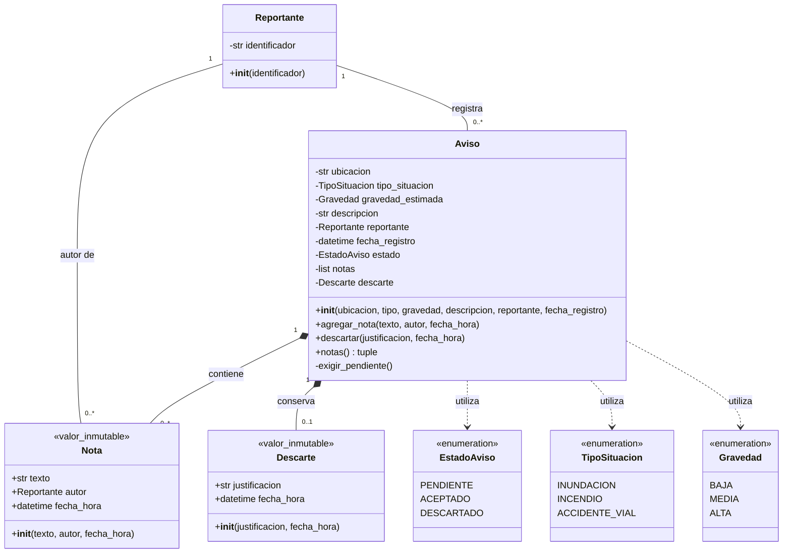

```mermaid

classDiagram
    direction TB

    class Reportante {
        -str identificador
        +__init__(identificador)
    }

    class Aviso {
        -str ubicacion
        -TipoSituacion tipo_situacion
        -Gravedad gravedad_estimada
        -str descripcion
        -Reportante reportante
        -datetime fecha_registro
        -EstadoAviso estado
        -list notas
        -Descarte descarte
        +__init__(ubicacion, tipo, gravedad, descripcion, reportante, fecha_registro)
        +agregar_nota(texto, autor, fecha_hora)
        +descartar(justificacion, fecha_hora)
        +notas() tuple
        -exigir_pendiente()
    }

    class Nota {
        <<valor_inmutable>>
        +str texto
        +Reportante autor
        +datetime fecha_hora
        +__init__(texto, autor, fecha_hora)
    }

    class Descarte {
        <<valor_inmutable>>
        +str justificacion
        +datetime fecha_hora
        +__init__(justificacion, fecha_hora)
    }

    class EstadoAviso {
        <<enumeration>>
        PENDIENTE
        ACEPTADO
        DESCARTADO
    }

    class TipoSituacion {
        <<enumeration>>
        INUNDACION
        INCENDIO
        ACCIDENTE_VIAL
    }

    class Gravedad {
        <<enumeration>>
        BAJA
        MEDIA
        ALTA
    }

    Reportante "1" -- "0..*" Aviso : registra
    Reportante "1" -- "0..*" Nota : autor de

    Aviso "1" *-- "0..*" Nota : contiene
    Aviso "1" *-- "0..1" Descarte : conserva

    Aviso ..> EstadoAviso : utiliza
    Aviso ..> TipoSituacion : utiliza
    Aviso ..> Gravedad : utiliza

```